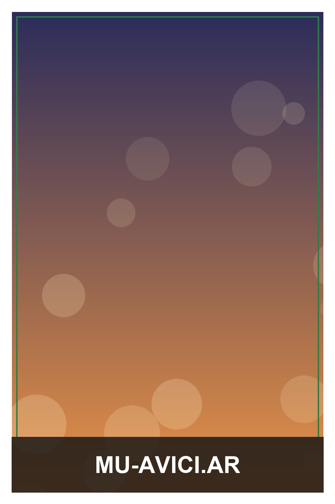

<h1 align="center">📸 DSRL Booth</h1>

<p align="center">
  <b>Aplicación de escritorio para preparar fotos de stand listas para imprimir.</b><br>
  Superpone un marco PNG sobre tus fotos y las ajusta al tamaño de impresión exacto, a 300 DPI.
</p>

<p align="center">
  
  
  
  
  
</p>

<p align="center">
  
</p>

---

## ✨ Qué hace

Pensada para el flujo real de un **stand de fotos**: en vez de editar imagen por imagen en
Photoshop, cargás una tanda entera, elegís el marco y el tamaño, y en segundos tenés todas
las fotos compuestas y listas para mandar a la impresora.

- 🖼️ **Marco encima de la foto** — superpone un PNG con transparencia sobre cada imagen.
- 📐 **Tamaños de impresión estándar** — 10×15, 15×20, 13×18 y 9×13 cm, siempre a **300 DPI**.
- 🎯 **Ajuste inteligente** — recorta para llenar (sin bordes ni deformación), ajusta entera
  con borde, o estira, según lo que necesites.
- 🔄 **Orientación automática** — el marco define si la salida es vertical o apaisada, y se
  respeta la rotación EXIF de la cámara.
- 🖱️ **Arrastrar y soltar** — tirá fotos (o una carpeta entera) directo a la lista.
- ⚡ **Procesamiento por lotes en segundo plano** — con barra de progreso, sin que se cuelgue
  la ventana aunque mandes cientos de fotos.
- 💎 **Sin pérdida de calidad** — las fotos de una DSLR siempre tienen más resolución de la
  necesaria, así que solo se reducen al tamaño de impresión. Nunca se agrandan.

## 🚀 Uso

1. Doble clic en **`run.bat`**.
   La primera vez crea el entorno e instala las dependencias solo; las siguientes abre la app directamente.
2. En la ventana:
   1. **Seleccionar marco** → tu PNG (guardalos en `marcos/`).
   2. Elegí el **tamaño de impresión** y el **modo de ajuste**.
   3. **Agregá las fotos** (botón o arrastrándolas).
   4. Elegí la **carpeta de salida** y presioná **CREAR**.

## 🧠 Cómo funciona el ajuste

Conviene separar dos conceptos:

| Concepto | Qué es | Efecto |
| --- | --- | --- |
| **Resolución** | Cantidad de píxeles de la foto | Una DSLR siempre da de sobra → la foto solo se reduce, nunca pierde nitidez. |
| **Proporción** | La "forma" del rectángulo | Solo genera recorte/borde cuando la foto (3:2) no coincide con el papel. |

En **10×15 cm** la proporción coincide con la de la cámara, así que nunca hay recorte.
En **15×20 cm** (4:3) la foto es más "finita" que el papel, y ahí entra el modo de ajuste elegido:

- **Recortar para llenar** *(predeterminado)* — cubre todo el papel y recorta un poco de los
  extremos. Sin bordes, sin deformar.
- **Ajustar entera (con borde)** — se ve la foto completa con franjas de relleno.
- **Estirar** — llena todo pero deforma (no recomendado para retratos).

## 🗂️ Estructura

```
DSRL-booth/
├─ run.bat                 ← arranque (instala dependencias y abre la app)
├─ requirements.txt
├─ marcos/                 ← tus marcos PNG
├─ salida/                 ← resultados generados (por defecto)
├─ scripts/
│  └─ crear_marco_ejemplo.py
├─ tests/
│  └─ test_processor.py    ← prueba automática del motor
└─ src/
   ├─ main.py              ← punto de entrada
   ├─ gui.py               ← interfaz (PySide6)
   ├─ processor.py         ← composición de imágenes (Pillow)
   └─ config.py            ← tamaños, DPI y ajustes
```

## 🛠️ Instalación manual (opcional)

```bash
python -m venv .venv
.venv\Scripts\pip install -r requirements.txt
.venv\Scripts\python src\main.py
```

## 📦 Generar un ejecutable

Para un `.exe` que no dependa de Python instalado:

```bash
.venv\Scripts\pip install pyinstaller
.venv\Scripts\pyinstaller --noconsole --onefile --name "DSRL-Booth" src\main.py
```

El ejecutable queda en `dist/DSRL-Booth.exe`.

## 📋 Requisitos

- Windows 10/11 con Python 3.10+ (probado en 3.12).
- Dependencias: **PySide6** y **Pillow** (se instalan solas con `run.bat`).

## 📄 Licencia

Distribuido bajo licencia MIT. Ver [`LICENSE`](LICENSE).
